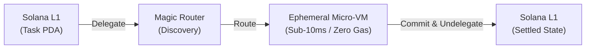

# Solaxis

> **The Sovereign Serverless Micro-Instance Engine for Solana.**  
> Execute zero-gas, sub-10ms compute loops offloaded from Solana L1 into Ephemeral Rollups (ER) and Private Ephemeral Rollups (PER inside Intel TDX TEE enclaves) — with atomic on-chain settlement.

[](https://explorer.solana.com/?cluster=devnet)
[](https://docs.magicblock.gg)
[](https://www.anchor-lang.com)
[](https://nextjs.org)
[](LICENSE)

---

## Overview

Traditional cloud serverless (e.g. AWS Lambda) forces Web3 apps onto centralized infrastructure, introducing vendor lock-in, centralized custody, and opaque execution. Running compute loops directly on Solana L1 is cost-prohibitive (~5,000 lamports per tx) and constrained by 400ms block times.

**Solaxis turns Solana state accounts (PDAs) into on-demand serverless micro-instances:**
- **Spin-up**: A state PDA is delegated from Solana L1 to the MagicBlock Delegation Program.
- **Execute**: High-frequency compute loops execute inside an Ephemeral Rollup (ER) or Private Ephemeral Rollup (PER inside an Intel TDX TEE enclave) at **sub-10ms block times with zero gas fees**.
- **Settle**: The final state commits atomically back to Solana Base Layer L1 via `MagicIntentBundleBuilder`, reverting account ownership with cryptographic finality.

---

## Key Highlights

- **Sub-10ms Execution**: Execute rapid state mutations (~65x faster than Solana L1 block times).
- **Zero-Gas Compute**: 0 Lamports consumed per execution iteration inside the rollup.
- **Developer SDK Platform**: Define custom serverless functions with `@solaxis/sdk` (`defineFunction`) and on-chain Anchor compute kernels (`solaxis-engine-sdk`).
- **Confidential Compute**: Hardware-isolated execution via Private Ephemeral Rollups (PER inside Intel TDX TEE enclaves).
- **Atomic Settlement**: Sealed state commits to L1 in a single transaction with automatic ownership reversion.
- **Triple Control Surfaces**: TypeScript Developer SDK (`@solaxis/sdk`), standalone CLI (`solaxis`), and real-time Web3 Developer Console.

---

## How It Works



---

## Performance Benchmark

| Metric | Solaxis Ephemeral Micro-VM | Traditional Solana L1 |
|---|---|---|
| **Iteration Latency** | **< 10ms** | 400 – 800ms slot confirmation |
| **Compute Gas Fee** | **0 Lamports** | ~5,000 Lamports per transaction |
| **50-Iteration Duration** | **~350ms** | ~25 – 40 seconds |
| **Settlement Cost** | **300k Lamports** (flat session fee) | 250k – 1M+ Lamports cumulative |
| **Gas Savings** | **> 99%** | Baseline |

---

## Repository Structure

```
├── sdk/          # Public TypeScript Developer SDK (@solaxis/sdk)
├── contracts/    # Solana Anchor smart contract & solaxis-engine-sdk Rust crate
├── shared/       # Protocol schemas, types, constants, PDA helpers & validators
├── cli/          # Developer CLI (solaxis new / init / status / invoke / deploy)
├── app/          # Next.js 15 Web3 Developer Console (Visualizer & CloudWatch stream)
└── docs/         # Documentation & Demo Video Storyboard (DEMO_VIDEO_SCRIPT.md)
```

---

## Developer SDK (`@solaxis/sdk`)

Solaxis allows any developer to author custom serverless compute functions and deploy them to Solana:

```typescript
import { defineFunction, SolaxisClient } from "@solaxis/sdk";

// 1. Define a custom serverless micro-instance function
export const riskSimulator = defineFunction({
  name: "batch-risk-simulator",
  description: "Monte Carlo asset risk simulation over high-speed ticks",
  defaultIterations: 50,
  targetValidator: "confidential-tee", // Runs inside Intel TDX TEE enclave
});

// 2. Initialize the client and attach real-time event listeners
const client = new SolaxisClient({ cluster: "devnet" });

client.on("progress", (event) => {
  console.log(`[Tick ${event.currentIteration}/${event.totalIterations}] Output: ${event.currentOutput}`);
});

// 3. Invoke end-to-end: L1 delegation -> ER compute loop -> L1 settlement
const metrics = await client.invoke(riskSimulator, { iterations: 50 });
console.log(`Settled in ${metrics.totalDurationMs}ms (Gas Saved: ${metrics.l1GasSavedPercent}%)`);
```

---

## Quickstart

### Prerequisites

- **Node.js**: `>= 20.x` with `pnpm` installed (`npm i -g pnpm`)
- **Rust Toolchain**: `rustc >= 1.79` (`1.89+` / `1.91+` supported)
- **Solana CLI**: `>= 1.18` configured to Devnet
- **Anchor CLI**: `anchor 0.32.1`
*(Note: On Windows, Solana CLI, Rust, and Anchor run via WSL).*

### Installation

```bash
git clone https://github.com/Team-Managed/Solaxis.git
cd Solaxis
pnpm install
```

### Environment Configuration

```bash
cp .env.example .env
```

Set `DEMO_REDIRECT_URL` in the Render client service to make `/demo` redirect to the hosted demo video or presentation URL.

### Build and Run

```bash
# Build the Anchor smart contract
cd contracts && anchor build && cd ..

# Run the standalone CLI
pnpm --filter @solaxis/cli solaxis invoke --iterations 50

# Launch the Web Developer Console
pnpm --filter @solaxis/app dev
```

### Custom Function Workflow

Generate a standalone Anchor/SBF function project with its own program keypair:

```bash
pnpm solaxis new order-event-processor
cd functions/order-event-processor
anchor build
cd ..
pnpm solaxis deploy --program-path functions/order-event-processor/target/deploy/order_event_processor.so --program-keypair functions/order-event-processor/program-keypair.json
cd functions/order-event-processor
pnpm install
pnpm invoke
```

The generated function implements the Solaxis protocol (`initialize`, `delegate`,
`execute_batch`, and `undelegate`) and its `solaxis.config.ts` contains the
deployed program ID. `SolaxisClient` routes invocation to that custom program
instead of the platform engine when `programId` is present.

---

## License

Distributed under the [MIT License](LICENSE).
