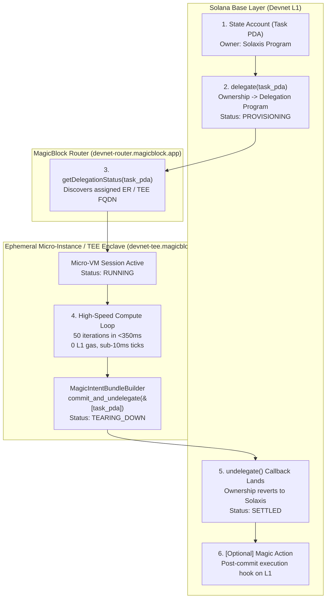

# Solaxis — Project Overview

## Overview

**Solaxis** is the Serverless Web3 Micro-Instance Engine for Solana. It functions like AWS Lambda or serverless micro-instances on the local device or edge, but without AWS or centralized cloud servers running the infrastructure and making it natively Web3.

By uniting **MagicBlock Ephemeral Rollups (ER)** and **Private Ephemeral Rollups (PER with Intel TDX TEE)** with the sovereign, local-first computing philosophy of **Urbit**, Solaxis allows developers and users to spin up isolated micro-instances directly from Solana state accounts (PDAs), execute high-frequency or confidential compute at sub-10ms latency with zero base-layer gas fees, and atomically tear down the instances upon task completion, committing the final settled state back to Solana L1.

---

## Goals

1. **Serverless Without Servers**: Eliminate the reliance on centralized cloud functions (AWS Lambda, GCP Cloud Functions) for Web3 and decentralized applications.
2. **Deterministic Spin-Up via Delegation**: Transfer account ownership temporarily from Solana L1 to the Delegation Program (`DELeGGvXpWV2fqJUhqcF5ZSYMS4JTLjteaAMARRSaeSh`), spinning up an isolated ephemeral execution sandbox on demand.
3. **Sub-10ms Ephemeral SVM Execution**: Execute multi-step, batch, or high-frequency instructions in memory inside the Ephemeral Solana Virtual Machine at zero L1 gas cost.
4. **Hardware-Enforced Confidentiality (TEE)**: Support execution inside Trusted Execution Environments (Intel TDX TEE) where state memory is cryptographically shielded from host nodes with remote attestation.
5. **Atomic Teardown & Settlement**: Use `MagicIntentBundleBuilder.commit_and_undelegate` to atomically seal state changes, revert PDA ownership back to the parent program on L1, and dismantle the micro-instance.
6. **Dual Control Surfaces**: Provide both a developer-friendly terminal **CLI (`solaxis`)** and a **Web3 Developer Console (Web Dashboard)** with live lifecycle telemetry and decentralized CloudWatch-style logs.
7. **Transparent On-Chain Verification**: Provide clickable Solana Explorer links for every invocation proving delegation, execution, and settlement on Solana Devnet.

---

## Core Lifecycle

---

## The Full Suite Deliverables

| # | Deliverable | Technology | Role |
|---|---|---|---|
| 1 | **On-Chain Engine** | Anchor 0.30+ / Rust / `ephemeral-rollups-sdk` | Deployed on Solana Devnet. Implements `#[ephemeral]`, `#[delegate]`, `initialize`, `delegate`, `execute_batch`, and `undelegate` via `MagicIntentBundleBuilder`. |
| 2 | **Standalone CLI Tool** | Node.js / TypeScript / `@magicblock-labs/ephemeral-rollups-sdk` | Terminal command-line runner (`solaxis init`, `solaxis status`, `solaxis invoke`). Provides live ASCII spinner, telemetry tables, and Explorer links. |
| 3 | **Web Developer Console** | Next.js (App Router) / Tailwind CSS / Lucide / Solana Wallet Adapter | Futuristic dark-mode dashboard featuring function catalog, 4-stage visual pipeline, decentralized CloudWatch log terminal, and benchmark comparison cards. |

---

## Deliverables & Screen Roster

| ID | Interface | Description |
|---|---|---|
| **CLI-1** | `solaxis init` | Creates and funds a new task state PDA on Solana Devnet. |
| **CLI-2** | `solaxis status` | Queries MagicBlock Router (`devnet-router.magicblock.app`) for delegation status and active ER endpoint. |
| **CLI-3** | `solaxis invoke` | Executes the full lifecycle: delegates PDA, runs compute loop on ER, undelegates, and outputs latency/gas metrics. |
| **UI-S1** | **Console Shell** | App header, cluster switcher (`Solana Devnet`), node indicator (`MagicBlock TEE`), and wallet connect button. |
| **UI-S2** | **Function Catalog** | Pre-configured task templates (`batch-risk-simulator`, `confidential-state-hasher`, `session-counter`). |
| **UI-S3** | **Invocation Trigger Panel** | Parameter inputs (iterations, seed, task PDA) and prominent "Run Micro-Instance" CTA. |
| **UI-S4** | **4-Stage Lifecycle Visualizer** | Live animated state pipeline: `PROVISIONING` (Amber) ➔ `RUNNING` (Neon Green) ➔ `TEARING_DOWN` (Cyan) ➔ `SETTLED` (Emerald). |
| **UI-S5** | **Decentralized CloudWatch** | Terminal window streaming real-time JSON-RPC transaction logs, block hashes, and sub-10ms timing marks. |
| **UI-S6** | **Benchmark & Proof Card** | Side-by-side comparison (L1 vs Solaxis latency & gas saved) + direct Solana Explorer transaction verification links. |

---

## Scope

### In Scope
- On-chain Anchor smart contract upgraded with MagicBlock Ephemeral Rollup macros (`#[ephemeral]`, `#[delegate]`).
- Task PDA lifecycle management: initialization, delegation, rapid compute iterations, and commit-and-undelegate.
- Integration with live MagicBlock infrastructure on Devnet (`devnet-router.magicblock.app`, `devnet-tee.magicblock.app`, `devnet-as.magicblock.app`).
- Standalone CLI executable via `npx solaxis` or global install.
- Production-grade Web3 Developer Console with dark theme, responsive canvas, and real-time event streaming.
- Benchmark and cost savings calculator based on real execution metrics.
- Clickable transaction links to Solana Explorer (`https://explorer.solana.com/?cluster=devnet`).

### Out of Scope (v1)
- Arbitrary untrusted WASM execution sandbox (v1 is native SVM / Anchor SBF bytecode).
- Multi-chain bridging outside of Solana.
- Production mainnet payments or billing subscription plans (v1 targets Devnet live demo & developer adoption).
