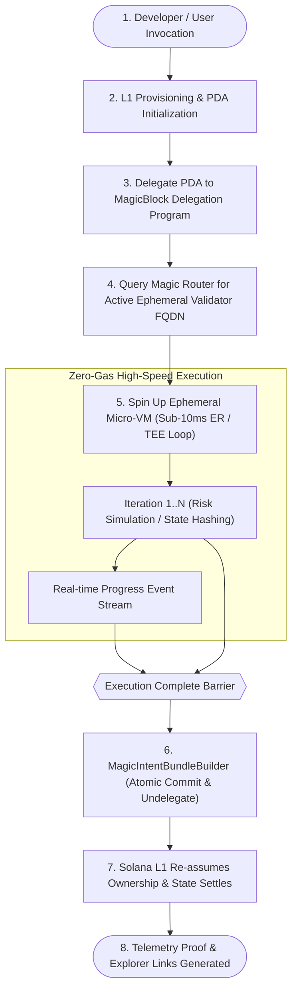

# Solaxis - Product Map

> The Serverless Web3 Micro-Instance Engine for Solana. Functioning like AWS Lambda, but without AWS or centralized cloud servers, powered by MagicBlock Ephemeral Rollups and TEE.

Read this file before any other spec. Every numbered spec assumes the vocabulary, screens, and contracts defined here.

---

## 1. The Product In One Paragraph

Solaxis turns Solana state accounts into on-demand serverless micro-instances. Instead of paying continuous cloud server bills on centralized infrastructure or suffering from slow block times and cumulative transaction fees on Solana L1, a developer or user triggers an execution task: Solaxis provisions a state account (PDA), delegates it to a MagicBlock Ephemeral Rollup (or Private Ephemeral Rollup inside an Intel TDX TEE enclave), executes high-frequency compute loops at sub-10ms latency with zero L1 gas fees, and atomically commits the final state back to Solana L1 while undelegating the account. The system delivers this functionality through two first-class consumer surfaces: a standalone terminal CLI (`solaxis`) for developers and automated pipelines, and a visual Web3 Developer Console with real-time visualizer tracks, streaming decentralized logs, and verifiable benchmark analytics.

## 2. Core Loop

The execution loop is deterministic and verifiable. The initial state exists on Solana Base Layer L1; execution occurs inside a dedicated Ephemeral Rollup runtime with sub-10ms block generation; and the terminal state is committed back to L1 in a single atomic transaction. PDA ownership reverts from the Delegation Program back to the Solaxis Anchor program via an undelegation callback processor.

## 3. Stack (locked)

| Layer | Choice |
| --- | --- |
| Smart Contract | Anchor Framework (v0.30.1) on Solana Devnet |
| Rollup Engine | MagicBlock Ephemeral Rollups SDK (v0.16.2) with `#[ephemeral]`, `#[delegate]`, and `#[commit]` |
| Confidential Compute | MagicBlock Private Ephemeral Rollups (PER) in Intel TDX TEE Enclave |
| Delegation Program | MagicBlock Delegation Program on Solana Devnet (`DELeGGvXpWV2fqJUhqcF5ZSYMS4JTLjteaAMARRSaeSh`) |
| Router & Discovery | MagicBlock Router (`https://devnet-router.magicblock.app`) querying `getDelegationStatus` |
| Monorepo Manager | pnpm workspaces (Node.js 20+) |
| Developer SDK | `@solaxis/sdk` (TypeScript client SDK) + `solaxis-engine-sdk` (Rust Anchor crate) |
| Shared Layer | Internal TypeScript contracts package (`packages/shared`) with Zod schemas |
| CLI Runner | Standalone Commander.js executable (`packages/cli`) with Chalk, Ora, and scaffolding |
| Developer Console | Next.js 15 (App Router) + React Server Components + Client Hooks |
| Styling & Theme | Tailwind CSS + CSS Custom Properties (Deep Obsidian, Solar Amber, Neon Emerald) |
| UI Primitives | Custom hand-crafted components (Button, Card, Badge, Skeleton, Sheet, Terminal) |
| Web3 Integration | Solana Wallet Adapter (Phantom, Solflare) + `@solana/web3.js` |

### Architecture rules (non-negotiable across all specs)

1. **Undelegation Callback Guarantee.** The Anchor smart contract must place the `#[ephemeral]` macro immediately preceding `#[program]`. This injects the mandatory undelegation callback processor with discriminator `[196, 28, 41, 206, 48, 37, 51, 167]`. Without this macro, the MagicBlock Delegation Program cannot return PDA ownership back to the Solaxis engine upon commit.
2. **Modern Intent Bundle Settlement.** Always decorate the undelegate context with `#[commit]` (which injects `magic_context` and `magic_program`) and use `MagicIntentBundleBuilder.commit_and_undelegate` from the modern Ephemeral Rollups SDK. Never use deprecated `commit_accounts` or `commit_and_undelegate_accounts` instructions. Extract the L1 settlement signature via `GetCommitmentSignature(erTxHash, erConnection)`.
3. **Dynamic Router Discovery.** Client code must never hardcode static regional rollup URLs or assume validator availability. All client runners must query `router.getDelegationStatus(taskPda)` against the MagicBlock router endpoint to discover the active validator fully-qualified domain name (FQDN).
4. **Clean Monorepo Deployables.** The repository contains dedicated packages: `packages/contracts` (Anchor smart contract & Rust crate), `packages/sdk` (TypeScript Developer SDK), `packages/cli` (CLI runner with scaffolding & deploy), `packages/app` (Next.js Developer Console), and `packages/shared` (internal contracts and schemas).
5. **First-Class Developer SDK.** Solaxis provides `@solaxis/sdk` for client-side orchestration, custom function definition (`defineFunction`), and real-time execution streaming, paired with `solaxis-engine-sdk` Rust crate for authoring custom on-chain compute kernels.
6. **No Centralized Cloud Infrastructure.** Execution occurs purely on-chain (Solana L1) and on decentralized rollup validators (MagicBlock ER / TEE). No AWS Lambda, EC2, Cloudflare Workers, or centralized databases are permitted in the execution path.
7. **Every Invocation Generates Verifiable Proof.** Every completed run must produce valid Solana Explorer transaction signatures for both the initial delegation on L1 and the final state settlement on L1.
8. **Deterministic Millisecond Telemetry.** Duration metrics for Spin-up, Ephemeral Execution, and Teardown must be captured with millisecond accuracy using monotonic performance clocks, never estimated or mock-generated.

## 4. Execution Lifecycle & Subsystem Roster

The Solaxis architecture is divided into specialized subsystems that coordinate state across L1 and Ephemeral Rollups.

| # | Subsystem | Responsibility | Writes / Outputs |
| --- | --- | --- | --- |
| 1 | **Anchor Engine** (`solaxis-engine`) | On-chain Anchor program defining PDA state, delegation CPI, compute loops, and settlement | `TaskAccount` PDA state on Solana Devnet |
| 2 | **Rust Function Crate** (`solaxis-engine-sdk`) | On-chain traits, macros, and CPI helpers for developers building custom Anchor compute kernels | Reusable Anchor compute modules |
| 3 | **Shared Contracts** (`packages/shared`) | Canonical Zod schemas, inferred types, PDA derivation utilities, and RPC constants | Shared validation contracts and constants |
| 4 | **Developer SDK** (`packages/sdk`) | Public TypeScript client SDK (`@solaxis/sdk`) with `SolaxisClient`, `defineFunction`, and event streams | Programmatic API for dApps and runners |
| 5 | **Lifecycle Controller** | Orchestration engine managing L1 initialization, delegation, router polling, ER execution, and undelegation | Observable lifecycle events and telemetry payloads |
| 6 | **CLI Runner** (`packages/cli`) | Standalone terminal command runner with scaffolding (`new`, `deploy`), formatted spinners, tables, and exit codes | Terminal output, JSON telemetry exports |
| 7 | **Console App Shell** (`packages/app`) | Next.js 15 Web3 application shell, wallet provider, navigation, and layout grid | Interactive developer dashboard |
| 8 | **Lifecycle Visualizer** | Real-time 4-stage visual pipeline with animated SVG energy tracks and millisecond stopwatches | Visual execution progress and stage states |
| 9 | **CloudWatch Terminal** | Decentralized streaming JSON-RPC log viewer with level filtering and auto-scroll | Real-time console log stream |
| 10 | **Benchmark & Explorer Verifier** | Side-by-side cost and latency comparison analytics with direct Solana Explorer proof links | Verifiable performance cards and shareable reports |

## 5. Domain Vocabulary

Use these exact terms across all documentation, code symbols, accounts, and user interfaces:

- **Target Task**: The user-defined computational workload invoked as a serverless micro-instance.
- **Task PDA**: The Program Derived Address on Solana Base Layer initialized from seeds `['solaxis_task', authority, taskId]`.
- **Authority**: The public key of the user or client wallet that owns and pays for the micro-instance.
- **Delegation Program**: The MagicBlock system program on Solana Devnet (`DELeGGvXpWV2fqJUhqcF5ZSYMS4JTLjteaAMARRSaeSh`) that temporarily holds account ownership during ephemeral execution.
- **Magic Router**: The MagicBlock routing service (`https://devnet-router.magicblock.app`) that maps delegated PDAs to active rollup validators.
- **Ephemeral Rollup (ER)**: The high-speed MagicBlock execution engine producing blocks under 10ms with zero gas cost for delegated accounts.
- **Private Ephemeral Rollup (PER)**: An Ephemeral Rollup executing within a secure Intel TDX hardware enclave (TEE) for confidential computation.
- **Ephemeral Micro-VM**: The conceptual serverless execution environment created when a PDA is delegated to an ER or TEE validator.
- **Magic Intent Bundle**: The atomic instruction payload constructed via `MagicIntentBundleBuilder` to commit state updates and undelegate accounts back to L1.
- **Compute Iteration**: A single execution step within the micro-instance batch (e.g., one risk model simulation cycle or hash operation).
- **Telemetry Snapshot**: The structured metrics captured across the invocation lifecycle, including spin-up duration, execution duration, teardown duration, and transaction signatures.
- **Gas Saved Delta**: The percentage and nominal SOL/lamports saved by running compute iterations inside the ER rather than issuing individual L1 transactions.

## 6. Screens And Surfaces: What The User Sees

### S1 - Function Catalog & Invocation Control
The primary control panel in the Web Console. Features a three-card function selector for pre-configured serverless workloads: Batch Risk Simulator (financial Monte Carlo modeling), Confidential State Hasher (TEE enclave hashing), and High-Frequency Session Counter (rapid state updates). Below the selector sits an invocation configuration panel with an iteration slider (1 to 200 iterations), a numeric random seed input, a delegated validator mode selector (Standard ER vs Confidential TEE), and a primary invocation button (`Launch Micro-Instance`).

### S2 - 4-Stage Lifecycle Visualizer
The central visual component of the Web Console. Displays four horizontal pipeline nodes connected by dynamic energy tracks:
1. **Spin-up (Provisioning)**: L1 transaction delegating the Task PDA to the MagicBlock Delegation Program.
2. **Ephemeral Micro-VM (Compute)**: Active sub-10ms execution loop inside the Ephemeral Rollup or TEE enclave.
3. **Teardown (Settlement)**: Atomic `MagicIntentBundleBuilder` commit and undelegation transaction.
4. **Settled (L1 Base)**: Solana Base Layer re-verifying ownership reversion and final account state.
Each node displays its active status (Pending, Active/Pulsing, Completed with checkmark, or Error), a dedicated millisecond stopwatch timer, and an inspect drawer trigger.

### S3 - Decentralized CloudWatch Terminal Stream
A monospace developer terminal styled with dark glass aesthetics and simulated CRT scanlines. Streams real-time JSON-RPC execution logs as instructions are submitted to the ER validator. Each log line displays a UTC timestamp, a colored log-level badge (`INFO`, `RPC`, `COMPUTE`, `SUCCESS`, `WARN`, `ERROR`), and structured message content. Features include sticky auto-scroll to bottom, log-level filter toggles, search text filtering, clear console action, and one-click copy to clipboard.

### S4 - Benchmark & Verifiable Proof Explorer
A post-execution analytics panel comparing Solaxis against traditional Solana L1 execution. Displays side-by-side metric cards:
- Total Latency: Solaxis (sub-10ms per iteration) versus Solana L1 (400-800ms slot confirmation).
- Gas Cost: Zero lamports spent inside ER versus cumulative L1 transaction fees.
- Efficiency Delta: Explicit percentage badge showing gas saved (up to 99.8%).
- Explorer Verification: Clickable links to Solana Explorer for the L1 Delegation signature and L1 Settlement signature, verifying genuine on-chain execution.

### S5 - Standalone Terminal CLI Experience
The developer CLI tool invoked via `solaxis <command>`. Commands include:
- `solaxis init`: Initializes a Task PDA on Solana Devnet and checks payer balance.
- `solaxis status`: Queries on-chain PDA state and Magic Router delegation status, displaying results in an ASCII table.
- `solaxis invoke`: Orchestrates the complete 5-step lifecycle in the terminal, rendering animated Ora spinners, millisecond elapsed counters, an ASCII telemetry summary card, and clickable Solana Explorer URLs.

## 7. States Every Screen and Runner Must Handle

- **Idle**: Initial ready state before invocation. Controls are enabled; visualizer nodes are inactive; terminal displays connection readiness.
- **Provisioning**: L1 initialization or delegation transaction is confirming. Spin-up node pulses; terminal streams L1 RPC status; primary button enters loading state.
- **Running (Delegated)**: Task PDA is delegated; ER validator is processing high-frequency iterations. Ephemeral node pulses emerald; terminal streams sub-10ms iteration events; progress bar updates.
- **Tearing Down (Settling)**: `MagicIntentBundleBuilder` transaction submitted. Teardown node pulses amber; terminal announces atomic commit.
- **Settled (Verified)**: Full lifecycle completed successfully. All nodes render complete checkmarks; stopwatch timers freeze; benchmark comparison card unlocks; Explorer links are populated.
- **Low Balance / Airdrop Needed**: User wallet has insufficient Devnet SOL (<0.05 SOL) to fund rent and transactions. Renders a clear warning with an airdrop helper button or command instruction.
- **Router Timeout / Fallback**: Magic Router takes longer than expected to report delegation status. Shows an actionable retry status with backoff indicator rather than crashing.
- **Transaction Failure**: Any step fails on-chain. Node switches to error state with red border and alert icon; terminal outputs the parsed Solana error code and instruction trace; targeted retry button is presented.

## 8. Non-Goals

- No centralized backend services, cloud databases, or AWS Lambda functions. Solaxis is exclusively Web3 native.
- No arbitrary untrusted WASM/JS sandbox in the on-chain kernel. All custom compute functions are compiled to native Solana SBF bytecode via Anchor or orchestrated via `@solaxis/sdk`.
- No custodial wallet management or server-side private key storage for Web Console users. All web transactions are signed by the user's browser wallet.
- No closed-source off-chain compute. All computation runs inside open Ephemeral Rollup validators or verifiable Intel TDX TEE enclaves.
- No Mainnet deployment in v1. All implementation, contracts, and tests target Solana Devnet and MagicBlock Devnet infrastructure.

## 9. Spec Index

**Foundation**
- 01 Architecture and Shared Contracts
- 02 Design System and Tokens

**Core Engine**
- 03 Solaxis Anchor Engine
- 04 Delegation and Lifecycle Controller
- 05 Developer SDK and Custom Functions

**Terminal Runner**
- 06 Solaxis CLI Runner

**Developer Console**
- 07 Web Console App Shell
- 08 Live Lifecycle Visualizer
- 09 Decentralized CloudWatch Stream
- 10 Benchmark and Explorer Verification

**Verification & Quality**
- 11 Devnet E2E Verification and CI
